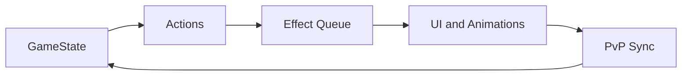

# Milchcards Architecture

This document gives a high-level view of how the game loop is structured and how the React UI, the turn-based engine, and the PvP relay interact.

## Core Loop



1. **GameState** holds the authoritative game state: current player, action points, hands, board, traps, discard, log, and effect queue.
2. **Actions** are player inputs (play a card, activate an ability, pass) that are validated against the current state and then translated into one or more queued effects.
3. **Effect Queue** resolves effects in order: draw, damage, influence, traps, auras, pass turn. This keeps complex card interactions deterministic and easy to test.
4. **UI and Animations** consume the resolved state and drive React components, canvas animations, and sound effects.
5. **PvP Sync** sends the same action stream to the remote client over a host-authoritative WebSocket relay, so both players stay in sync.

## State Flow

```
┌─────────────┐     player action      ┌──────────────┐
│   GameState  │ ──────────────────────▶ │ Action Queue │
└─────────────┘                         └──────────────┘
       ▲                                         │
       │         resolved effects                 ▼
       │◀──────────────────────────────┐  ┌─────────────┐
       │                             └──│  │ Effect Queue│
       │                                └─────────────┘
       │
       │        React re-render + canvas animations
       │◀──────────────────────────────────────────┐
                                                    │
                                            ┌───────────────┐
                                            │  UI/Animation  │
                                            └───────────────┘
```

## Key Modules

| Module | Role |
|--------|------|
| `src/state/` | Pure state helpers and reducers for `GameState`. |
| `src/engine/` | Turn logic, AI player, animation engine, character system. |
| `src/utils/queue.ts` | Effect queue resolution and card effect application. |
| `src/components/` | React UI components: board, hand, deck builder, modals. |
| `src/components/GameCanvas.tsx` | Canvas-based rendering of the board and hand. |
| `src/context/` | React contexts for audio, visual effects, and PvP connection. |
| `src/pvp/` | WebSocket client that talks to the relay in `server/`. |
| `server/index.js` | Host-authoritative relay that forwards actions to the room peer. |

## PvP Sync

The PvP relay is intentionally simple: the host (player who created the room) is the authoritative source of truth. Every validated action is broadcast to the guest, who applies the same action locally. This keeps the clients synchronized without running a full game simulation on the server.

```
Host client ──action──▶ Relay ──action──▶ Guest client
   │                                          │
   ▼                                          ▼
GameState update                      GameState update
```

## Notes

- The animation engine in `src/engine/animationEngine.ts` is currently used for the intro/brand video sequence and visual effects; tighter integration with the card effect queue is a planned improvement.
- The AI opponent is heuristic and lives in `src/ai/aiPlayer.ts`.
