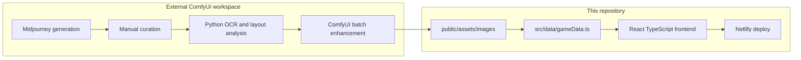

# Milchcards: AI-Driven Asset Pipeline & Automation

[](https://www.netlify.com/)
[](https://reactjs.org/)
[](https://www.typescriptlang.org/)
[](https://www.python.org/)

## About This Project

Welcome! While this repository contains the assets and logic for a playable card game, its **primary purpose is a Proof of Concept (PoC)**. It showcases an end-to-end automated workflow leveraging generative AI, Python scripting, and digital asset management.

Instead of manually crafting hundreds of assets, I built a scalable pipeline that handles everything from initial image generation to final card assembly. If you are interested in workflow automation, AI image generation, or Python-based image processing, you are in the right place.

The playable React frontend exists as a **delivery vehicle** — it proves the assembled assets work in a real product context, not just as static files.

---

## The Architecture & Workflow

This project breaks down into three core phases. The generation and assembly tooling runs **outside this repository**; finished PNGs are committed under [`public/assets/images/`](public/assets/images/) and wired into the game via [`src/data/gameData.ts`](src/data/gameData.ts).



### 1. Generative AI & Prompt Engineering (Midjourney)

Every raw asset was generated using Midjourney. To ensure stylistic consistency across the entire deck, I developed strict, structured prompt architectures — one template per card category (politician, initiative, intervention).

The raw outputs were then manually curated and refined to meet the project's quality standards. Variation suffixes in filenames (e.g. `_Variation_1`) mark alternate generations that were reviewed before final selection.

**Example prompt structure** (politician cards):

```
[Subject name], political portrait, editorial illustration style,
dramatic rim lighting, dark slate background, cyber-political aesthetic,
high detail face, 1024x1024 --ar 1:1 --style raw --seed [SEED]
```

Full prompt templates and generation seeds are documented in [`docs/ai-pipeline.md`](docs/ai-pipeline.md).

### 2. Quality Review & Layout Analysis (Python)

Once raw Midjourney outputs were curated, a Python analysis step evaluated each candidate before batch processing:

- **OCR text extraction** (EasyOCR) to verify readable card metadata
- **Layout region detection** (border, artwork, text areas)
- **Quality metrics**: edge sharpness, text clarity, color palette consistency

This step lives in a separate **ComfyUI automation workspace** (not committed here). The same workspace also contains unrelated sprite/GIF experiments — only the card-optimization tooling applies to this project.

Final category assignment (politician vs. initiative vs. intervention) was verified manually before export.

### 3. Automated Batch Enhancement (ComfyUI + Python)

Post-curation images were processed through a ComfyUI-connected Python pipeline:

| Tool | Role |
|------|------|
| `trading_card_optimizer.py` | Analyzes Midjourney card art (OCR, layout, quality scoring), runs ComfyUI enhancement workflows with LoRA upscaling |
| `batch_optimize_cards.py` | Batch-processes an input folder: contrast/sharpness enhancement, region-based artwork boost, resize to target dimensions |

Processing steps include edge sharpening, selective color/contrast enhancement, upscaling (RealESRGAN), and PNG export. Outputs were manually spot-checked, then committed to this repo.

Assembly outputs land in:

| Folder | Contents |
|--------|----------|
| `public/assets/images/politicians_1024x1024/` | Full-size politician card art |
| `public/assets/images/politicians_256x256/` | UI-scaled politician thumbnails |
| `public/assets/images/specials_1024x1024/` | Initiatives & interventions |
| `public/assets/images/specials_256x256/` | UI-scaled special card thumbnails |

Filename-to-card mapping is defined in `FILENAME_MAPPING` inside [`src/data/gameData.ts`](src/data/gameData.ts).

---

## AI Transparency & Compliance

**AI-assisted content disclosure:** Portions of this game's visual assets were created with generative AI tools and were reviewed, edited, and integrated by human creators.

Certain artwork used in this project originated from images generated with **Midjourney** under a paid commercial subscription and was subsequently modified, refined, and incorporated into the game's visual design by the developer. Commercial usage is subject to [Midjourney's Terms of Service](https://docs.midjourney.com/docs/terms-of-service) and applicable law.

> Artwork created with Midjourney and modified by the developer.

To ensure reproducibility and auditability:

- Core prompt structures are documented in [`docs/ai-pipeline.md`](docs/ai-pipeline.md)
- Generation seeds are stored in a structured format so base images can be traced back to their Midjourney origin
- Prompts, source generations, and edited versions are archived by the developer
- Manual curation was applied wherever AI output required human refinement
- No copyrighted characters, brands, or franchise IP were intentionally reproduced; figures are stylized editorial illustrations

**Example initiative prompt** (Spin Doctor card):

```
Spin Doctoring one forecourt tile with two faint light rings, a distant tile with one;
sunlit modernist courtyard; rule-of-thirds; ultramarine, white, cherry-red accents;
long shadows; clean geometry; ultra-sharp; smooth stone;
mood: selective persuasion; style: mid-century poster blended with contemporary realism
```

---

## In Action

Screenshots from the finished product — deck manager, card detail views, and live gameplay.

### Deck Manager

| | |
|---|---|
|  |  |
| Full-screen deck builder with preset archetypes | Card detail modal with stats and sources |
|  |  |
| Initiative card inspection | Intervention card inspection |
|  | |
| Politician card with influence breakdown | |

### Gameplay

| | |
|---|---|
|  |  |
| Tactical board with dual-lane layout | Mid-game state with active cards |
|  |  |
| Influence scoring and round tracking | Full board with interventions active |

### Card Types in Context

| | |
|---|---|
|  |  |
| Politician influence display | Sofort-Initiative in play |
|  | |
| Intervention card triggered mid-round | |

---

## Playable Frontend (Secondary)

The React/TypeScript app validates that assembled assets integrate correctly into a real UI. Key technical points:

- **State machine flow:** Intro → Main Menu → Deck Manager → Game Board → Credits ([`src/App.tsx`](src/App.tsx))
- **Responsive board scaling:** CSS 3D-transform viewport scaler (1920×1080 base, scales to any screen)
- **Game engine:** Turn-based logic, effect resolver queue, AI opponent ([`src/engine/`](src/engine/))
- **Balance verification:** 600+ headless AI-vs-AI simulations validated core deck archetypes at ~50% win rate

This frontend is intentionally lean — no experimental bloat, no unused dev tools — so the focus stays on the asset pipeline and the polished core experience.

---

## Getting Started

### Prerequisites

- [Node.js](https://nodejs.org/) v16 or higher
- npm or yarn

### Installation

```bash
git clone https://github.com/CosmicSlothOracle/Milchcards.git
cd Milchcards
npm install
npm run dev
```

Build the production bundle:

```bash
npm run build
```

### Deployment (Netlify)

Deployment is handled by **Netlify** via [`netlify.toml`](netlify.toml):

- **Build command:** `npm run build`
- **Publish directory:** `build`
- **SPA routing:** all routes redirect to `index.html`

Push to the connected branch (`main`) and Netlify rebuilds automatically. No manual deploy script is required.

For a local production preview after building:

```bash
npx serve -s build
```

---

## Why Build It This Way?

I thrive on finding efficient, creative solutions to technical bottlenecks. This project was a great playground to combine my interest in AI tools with hard software development skills, proving that creative design and technical precision can be seamlessly automated.

Feel free to explore the code, check out the [prompt structures](docs/ai-pipeline.md), or reach out if you want to chat about AI workflows!
